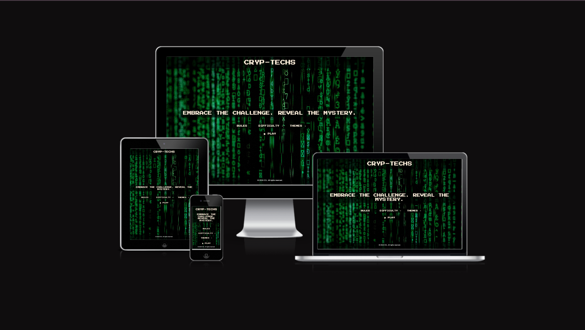
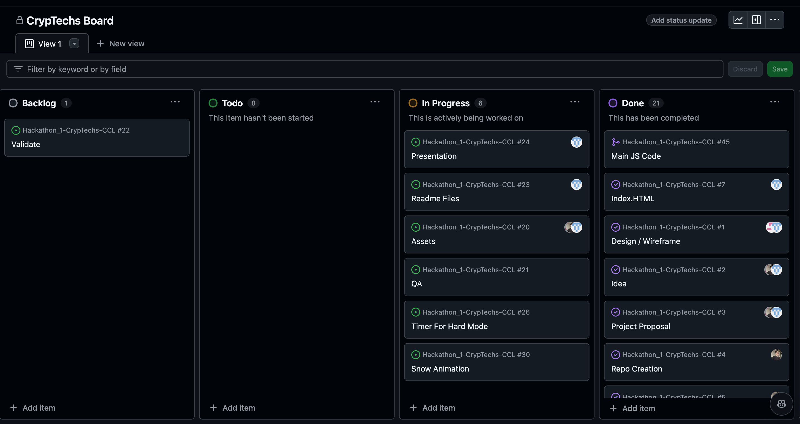
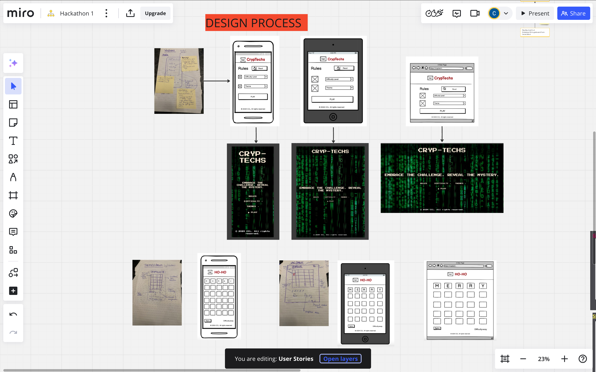
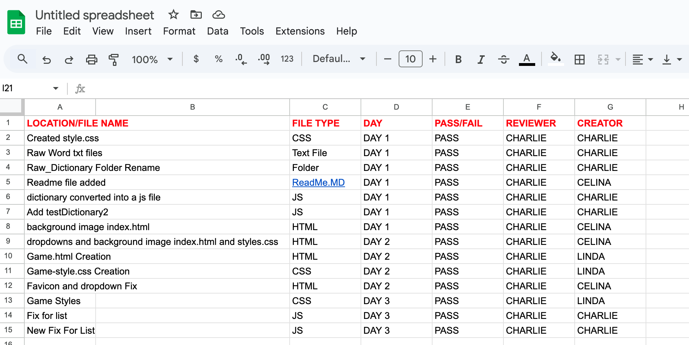
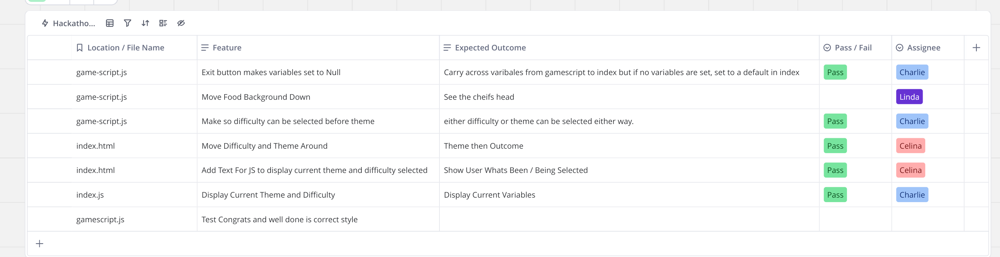

## Contents
- [Title](#title)
- [Live Site Link](#live-site-link)
- [Brief Introduction](#brief-introduction)
- [Responsivity Example Image](#responsivity-example-image)
- [Contents](#contents)
- [UX Design](#ux-design)
- [Design](#design)
- [Website Features](#website-features)
- [Future Features](#future-features)
- [Technologies Used](#technologies-used)
- [Testing](#testing)
- [Credits](#credits)

# Title - CRYP-TECHS 

## Live Site Link
[Live Site](https://charlieflockhart.github.io/Hackathon_1-CrypTechs-CCL/#)

## Brief Introduction
Cryp-Techs is an exciting and challenging word game that puts your puzzle-solving skills to the test. Inspired by the popular Wordle game, Cryp-Techs offers a unique twist with various themes and a festive touch.
Game Overview
Cryp-Techs is designed to be both entertaining and intellectually stimulating. Players are tasked with guessing a 5-letter word within six attempts, with feedback provided after each guess to help them get closer to the correct word. The game features different themes like Christmas, food, tech, and more, adding variety and fun to the experience.

How to Play
Start a New Game

Begin by clicking the "New Game" button. A random 5-letter word is selected based on the chosen theme.

Input Your Guess

Type your 5-letter word guess into the input box and press the "Submit" button.

Receive Feedback

After each guess, the game provides feedback:

Green: The letter is correct and in the right position.

Yellow: The letter is correct but in the wrong position.

Gray: The letter is incorrect.

Use this feedback to refine your next guesses.

Hints

If you need assistance, click the "Hint" button to receive a helpful clue. Hints might reveal a correct letter or provide additional context.

Difficulty 

We wanted to add an element to the game for those looking to challenge themselves further. By setting the difficulty to hard, the user only gets 5 guesses (rather than 6) and has a set time to guess the word. 

## Responsivity

## UX Design
USER EXPERIENCE

TARGET AUDIENCE: 
Gamers, puzzlers, anyone who enjoys brain-teasers and brain-training activities and people wanting to improve their English vocabulary.

USER STORIES: 

USER STORY 1: ACCESSIBLE DESIGN 
As a visually impaired user: i want the game to follow accessibility guidelines so that i can use a screen reader and navigate the game easily. 

ACCEPTANCE CRITERIA:
All interactive elements are accessible via keyboard. 
The game provides text alternatives for visual content. 
No WCAG errors in the implementation. 

USER STORY 2: RESPONSIVE LAYOUT 
As a player using various devices, i want the game to adapt to different screen sizes. So that i can have a consistent experience on desktop tablet and mobile. 

ACCEPTANCE CRITERIA: 
Use CSS media queries, Flexbox, or Grid.
Ensure no major errors/loss of functionality across devices.

USER STORY 3: USER-FRIENDLY INTERFACE
As a casual gamer, i want an intuitive and visually appealing interface so that i can easily navigate the game. 
I want each theme within the game to maintain its own unique identity, while also ensuring that the overall interface of the entire webpage remains cohesive and visually harmonious. This balance will enhance the user experience, allowing players to fully immerse themselves in the game, regardless of the theme they choose. Achieving this consistency will make the game more enjoyable and engaging for everyone.

ACCEPTANCE CRITERIA:
Consistent styles and clear navigation.
Adherence to wireframes/mockups.

USER STORY 4: INTERACTIVE GAMEPLAY 
As a player,
I want dynamic updates and feedback during gameplay,
so that I can understand my progress and improve my guesses
.
ACCEPTANCE CRITERIA:
JavaScript updates the interface in real-time based on user input.
Effective DOM manipulation of at least two elements.

USER STORY 5: FUNCTIONAL NAVIGATION 
As a user,
I want intuitive and functional navigation,
so that I can easily move through different sections of the game.

ACCEPTANCE CRITERIA: 
Semantic HTML markup for structure.
CSS media queries maintain layout integrity across screen sizes.

## Agile Methodology 

A project board was set up and the project divided into user stories. 
MosCoW prioritisation was used to prioritise the importance of tasks. 
The project board was used to organise sprints for time management and to keep track of tasks.
The project board can be found here (https://github.com/users/charlieflockhart/projects/5/views/1)

## Design

Our design for Cryp-Techs emphasizes accessibility, simplicity, consistency and responsiveness to ensure a seamless and engaging user experience. 
Our aim was to create a sleek, user-friendly website that maintains a cohesive and visually appealing aesthetic. 
The choice of font, the background imagery, and the game’s name all play into the cryptic and mysterious essence of the game, enhancing the overall immersive experience for our players.
The color scheme for the homepage was centered around the 'cryptic, encrypt, and cryptex' theme. 
For each individual theme of the game, we added a corresponding background image. 

## Website Features

HOMEPAGE 
- The main homepage is intended to be the centre of navigation for users to choose their game. 
- We included a modal to outline the rules of the game and how to use the site. 
- Dropdown menus for theme and difficulty level. 
- A play button to enter the chosen game. 

GAME PAGE 
- Grid to enter guesses. 
- Hint button provides users with a clue on the next letter. 
- Give up button ends the game and reveals the answers. 
- Green tile for when a letter is inserted in the correct place. 
- Yellow tile for when a correct letter is inserted but in the incorrect place. 
- Grey tile - incorrect letter. 
- Congratulations message when word guessed in two tries. 
- Well done message when word guessed in more than two tries. 
- Exit button that takes user back to homepage. 
- Corresponding background image to the theme chosen. 
- Snow falling animation on christmas theme. 

## Future Features
Planned features for future development.
- Seasonal themes for specific holidays e.g. a pancake day theme, halloween, valentines day.
- We would have liked to add an audio element for the themes i.e. christmas music, Gordan Ramsey yelling audio for the food page. 

## Technologies Used
- HTML
- CSS
- JavaScript

## Testing

## Credits
Acknowledgements and credits for contributors and resources.
- COPILOT 
- FAVICON GENERATOR 
- PEXELS - homepage background image link (https://www.pexels.com/photo/close-up-photo-of-matrix-background-1089438/)
- STORYSET - game pages images link (https://storyset.com/)
- YOUTUBE - Wordle JavaScript code inspiration (https://www.youtube.com/watch?v=oKM2nQdQkIU)